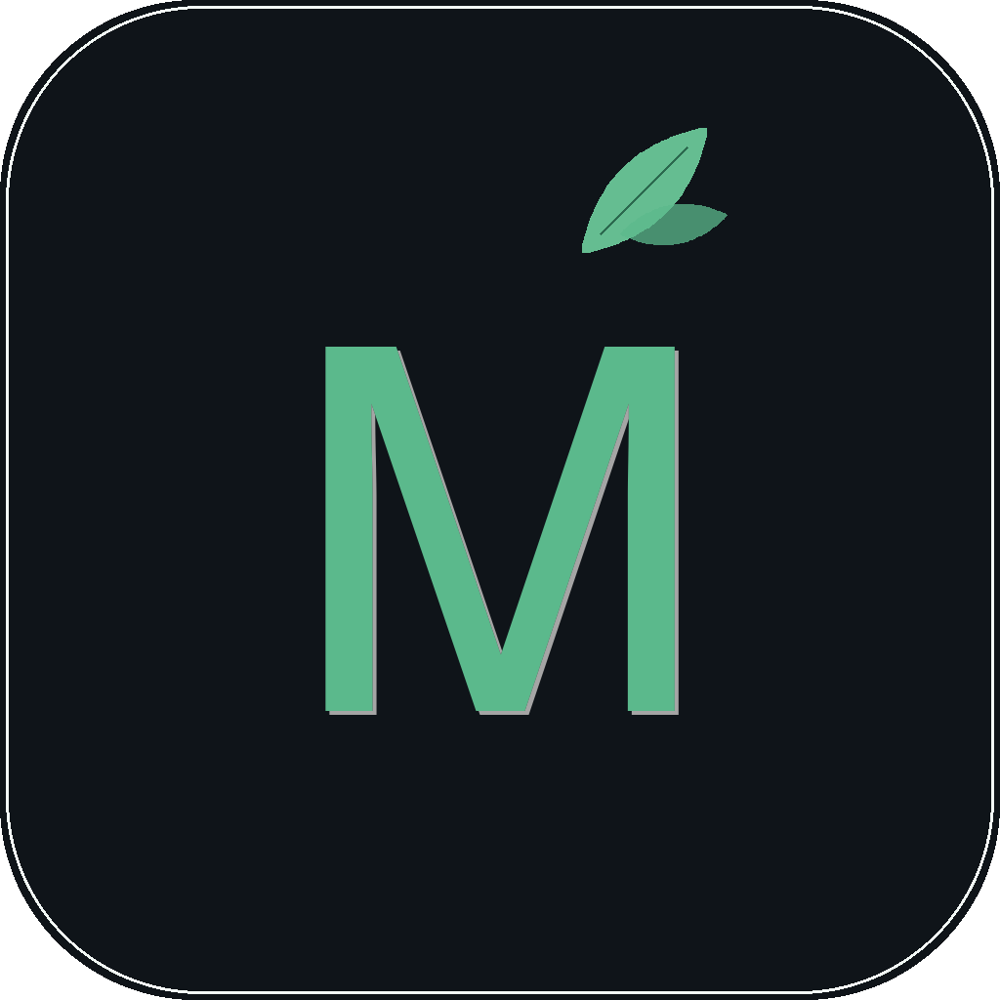

<p align="center">
  
</p>

<h1 align="center">Mossglim</h1>

<p align="center">
  <em>从一瞥到积累，从身边场景学英文</em>
</p>

## 名字的寓意

**Mossglim** = **Moss**（青苔）+ **Glim**mering（微光）

- **Moss 青苔** — 青苔生长于不经意的角落，日积月累、润物无声。象征词汇知识的自然积累，每一次学习都像一层薄苔，看似微小，日久便覆满整片石壁。
- **Glimpse 一瞥** — 生活中瞥见一段英文、一篇文章、一个标识，随手打开 Mossglim 就能即刻理解和记录。学习不需要正襟危坐，一瞥之间即可发生。
- **合在一起** — 青苔微光。每一次对身边英文的一瞥，都是一道微光；无数道微光汇聚，便长成了深厚的语言能力。

## 功能特性

- **AI 文本分析** — 粘贴任意英文文本，AI 自动完成翻译、句子结构拆解、词汇/短语/语法高亮标注
- **智能词库** — 分析中遇到的生词自动入库，支持按类型、状态筛选和搜索
- **间隔复习** — 基于艾宾浩斯遗忘曲线的复习系统，支持闪卡模式和速览模式
- **学习统计** — 词汇积累、复习进度、学习轨迹一目了然
- **多主题切换** — 深色 / 浅色 / 淡绿灰三套清新自然主题
- **多 AI 服务商** — 支持 Claude、OpenAI、XHS LLM

## 技术栈

- **桌面框架**: [Tauri 2](https://v2.tauri.app/)（Rust 后端 + WebView 前端）
- **前端**: React 19 + TypeScript + Tailwind CSS 4
- **状态管理**: Zustand
- **数据库**: SQLite（via tauri-plugin-sql）
- **AI 集成**: Claude / OpenAI / XHS LLM API

## 开发

```bash
# 安装依赖
npm install

# 启动开发服务器
npm run tauri dev

# 构建生产版本
npm run tauri build
```

## 项目结构

```
src/
  components/
    text/          # 文本输入与分析
    vocab/         # 词库管理
    review/        # 复习系统
    stats/         # 学习统计
    settings/      # 设置页面
  stores/          # Zustand 状态管理
  services/        # API 与数据库服务
src-tauri/
  src/             # Rust 后端（AI 调用、数据库迁移）
```

## 许可证

MIT
